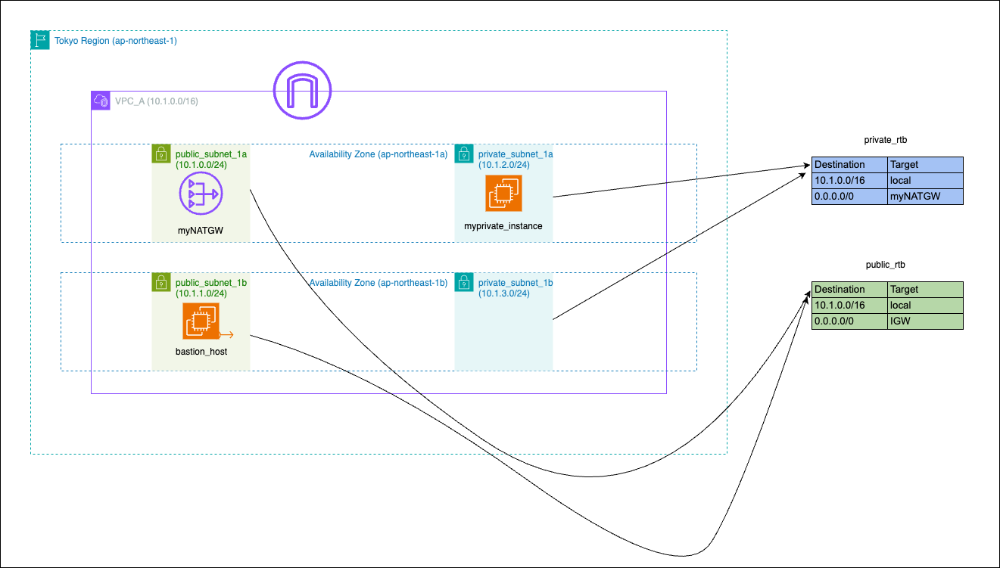

# Provisioning POC AWS infrastructure: VPC, subnets, gateways, bastion host, and private EC2 instance using Terraform modules

## Overview

This hands-on demonstrates creating a scalable AWS infrastructure using Terraform modules. It provisions a Virtual Private Cloud (VPC) with public and private subnets, NAT Gateway, Internet Gateway, and EC2 instances. 

## Infrastructure Design



This POC AWS infrastructure consists of:

- VPC with CIDR block 10.1.0.0/16
- 2 Public Subnets: 10.1.0.0/24 and 10.1.1.0/24
- 2 Private Subnets: 10.1.2.0/24 and 10.1.3.0/24
- Internet Gateway for public internet access
- NAT Gateway in public subnet for outbound internet access from private subnets
- Bastion host in public subnet
- Private EC2 instance in private subnet

Key components:
1. **VPC**: Isolated network environment in AWS
2. **Public Subnets**: Host internet-facing resources like the bastion host
3. **Private Subnets**: Host private resources not directly accessible from the internet
4. **Internet Gateway**: Allows communication between the VPC and the internet
5. **NAT Gateway**: Enables private subnet resources to access the internet
6. **Bastion Host**: Secure entry point for SSH access to private instances
7. **Private EC2 Instance**: Application server isolated from direct internet access

## Prerequisites

- AWS CLI configured with appropriate credentials
- Terraform installed
- Basic understanding of AWS services and Terraform

## Code Layout

```
.
├── main.tf
├── variables.tf
├── outputs.tf
├── modules/
│   ├── vpc/
│   ├── subnets/
│   ├── nat_gateway/
│   ├── security_groups/
│   └── instances/
├── AZ_ERROR_RESOLUTION.md
└── README.md
```

## Module Description

- `vpc`: Creates VPC and Internet Gateway
- `subnets`: Sets up public and private subnets
- `nat_gateway`: Configures NAT Gateway for private subnets
- `security_groups`: Defines security groups for EC2 instances
- `instances`: Launches EC2 instances (bastion and private)

## Customization

Modify the variables in `variables.tf` to customize:
- CIDR blocks for VPC and subnets
- EC2 instance types
- AMI IDs
- Region selection

## Security Considerations

- Bastion host is the only instance with a public IP
- Private instances are not directly accessible from the Internet
- Security groups control inbound and outbound traffic
- SSH access to private instances is only allowed through bastion host

## Troubleshooting

For information on resolving issues related to Availability Zone selection, see [AZ_ERROR_RESOLUTION.md](./AZ_ERROR_RESOLUTION.md).